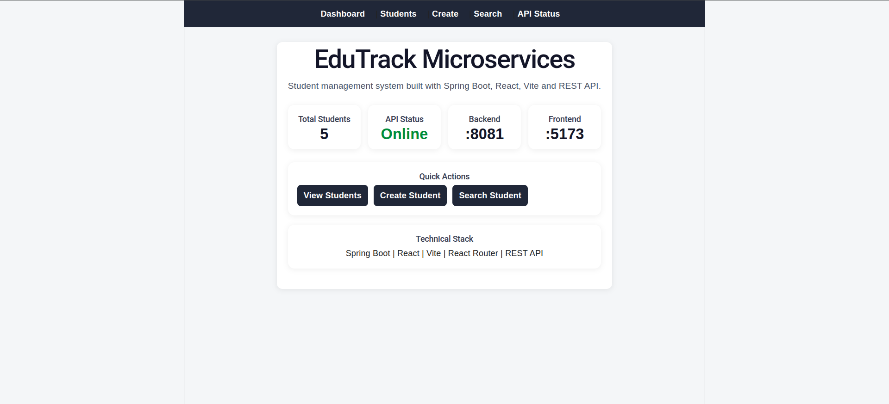

# EduTrack Microservices

Sistema educacional desenvolvido com arquitetura de microsserviços utilizando Java, Spring Boot e React.

---

# Preview da aplicação

<p align="center">
  
</p>

---

# Objetivo

Este projeto foi criado como um projeto de portfólio para consolidar conhecimentos em backend moderno, microsserviços e frontend integrado.

O foco principal é desenvolver uma aplicação incremental e explicável tecnicamente em entrevistas, demonstrando:

- APIs REST
- Microsserviços
- Arquitetura em camadas
- Frontend integrado com backend
- Docker
- PostgreSQL
- Mensageria
- Testes automatizados
- Boas práticas de engenharia de software

---

# Stack Tecnológica

## Backend

- Java 21
- Spring Boot
- Spring Web
- Spring Data JPA
- Hibernate

## Frontend

- React
- Vite
- JavaScript
- Fetch API

## Banco de Dados

- PostgreSQL

## Microsserviços e Infraestrutura

- RabbitMQ
- Spring Cloud Gateway
- Docker
- Docker Compose

## Testes

- JUnit
- Mockito

## Documentação

- OpenAPI / Swagger

## DevOps

- GitHub Actions

---

# Arquitetura do Projeto

O sistema está sendo desenvolvido utilizando arquitetura de microsserviços, onde cada domínio possui responsabilidade própria e independência estrutural.

## Microsserviços previstos

| Serviço | Responsabilidade |
|---|---|
| student-service | Gestão de alunos |
| classroom-service | Gestão de turmas e matrículas |
| activity-service | Gestão de atividades |
| grade-service | Gestão de notas e médias |
| notification-service | Consumo de eventos e notificações |
| api-gateway | Gateway centralizado da aplicação |

---

# Estrutura Atual do Projeto

```text
edutrack-microservices/
├── frontend/
├── student-service/
├── classroom-service/
├── activity-service/
├── grade-service/
├── notification-service/
├── api-gateway/
├── screenshots/
├── docs/
├── docker-compose.yml
└── README.md
````

---

# Status Atual do Desenvolvimento

Atualmente o projeto possui:

* `student-service` funcional
* Frontend inicial integrado
* Endpoints REST básicos
* Validação de entrada
* Tratamento global de erros
* Testes unitários básicos
* Integração frontend/backend

---

# Funcionalidades já implementadas

## Backend

* Estrutura Spring Boot
* Controller Layer
* Service Layer
* DTO Layer
* Injeção de Dependência
* Bean Validation
* Tratamento global de exceções
* Serialização JSON
* Testes unitários do Service Layer

## Frontend

* Dashboard inicial
* Listagem de alunos
* Cadastro de aluno
* Busca por nome
* Integração com API Spring Boot
* Recarregamento da lista
* Tratamento básico de erro

---

# Endpoints já implementados

## Listar alunos

```http
GET /students
```

### Exemplo de resposta

```json
[
  {
    "id": 1,
    "name": "João"
  },
  {
    "id": 2,
    "name": "Maria"
  }
]
```

## Buscar aluno por ID

```http
GET /students/{id}
```

### Exemplo

```http
GET /students/1
```

### Resposta

```json
{
  "id": 1,
  "name": "João"
}
```

## Buscar aluno por nome

```http
GET /students/search?name=Ana
```

### Resposta

```json
[
  {
    "id": 1,
    "name": "Ana"
  }
]
```

## Criar aluno

```http
POST /students
```

### Body

```json
{
  "name": "Carlos"
}
```

### Resposta

```json
{
  "id": 3,
  "name": "Carlos"
}
```

---

# Validação e tratamento de erros

O projeto já possui validação básica de entrada utilizando Bean Validation.

## Exemplo de requisição inválida

```http
POST /students
```

### Body inválido

```json
{
  "name": ""
}
```

### Resposta

```json
{
  "error": "Validation failed",
  "fields": {
    "name": "não deve estar em branco"
  },
  "status": 400
}
```

O tratamento global de erros é realizado utilizando:

* `@RestControllerAdvice`
* `@ExceptionHandler`
* `MethodArgumentNotValidException`

---

# Frontend

O projeto possui um frontend inicial em React + Vite para demonstrar visualmente o consumo da API `student-service`.

## Funcionalidades do frontend

* Listagem de alunos
* Cadastro de aluno
* Busca por nome
* Recarregamento da lista
* Integração com API Spring Boot
* Tratamento básico de erro de validação

---

# Conceitos já implementados

O projeto já demonstra:

* REST APIs
* Spring Controllers
* Service Layer
* DTO Pattern
* Dependency Injection
* Inversion of Control
* JSON Serialization
* Bean Validation
* Global Exception Handling
* Path Variables
* Query Parameters
* Request Body
* Arquitetura em camadas
* Programação Orientada a Objetos
* Docker Compose inicial
* Unit Testing com JUnit
* Integração frontend/backend
* React consumindo API Java

---

# Testes implementados

Atualmente o projeto possui testes unitários básicos do `StudentService`.

## Testes existentes

* `shouldReturnAllStudents`
* `shouldReturnStudentById`
* `shouldSearchStudentByName`
* `shouldCreateStudent`

## Executar testes

```bash
cd student-service
./mvnw test
```

---

# Roadmap Técnico

## Sprint 1 — student-service

* [x] Estrutura Spring Boot
* [x] Endpoints REST
* [x] Model `Student`
* [x] Service Layer
* [x] DTOs
* [x] Validação
* [x] Tratamento global de exceções
* [x] Testes unitários básicos
* [x] Frontend inicial React
* [ ] Integração com PostgreSQL

## Sprint 2 — Persistência com PostgreSQL

* [ ] Configuração do PostgreSQL
* [ ] Spring Data JPA
* [ ] Hibernate
* [ ] Entity `Student`
* [ ] Repository Layer
* [ ] Persistência real no banco

## Sprint 3 — classroom-service

* [ ] CRUD de turmas
* [ ] Matrículas
* [ ] Relacionamento aluno/turma

## Sprint 4 — activity-service

* [ ] Cadastro de atividades
* [ ] Tipos de atividade
* [ ] Integração com turmas

## Sprint 5 — grade-service

* [ ] Lançamento de notas
* [ ] Cálculo de médias
* [ ] Histórico acadêmico

## Sprint 6 — RabbitMQ

* [ ] Eventos entre serviços
* [ ] Publicação e consumo de mensagens

## Sprint 7 — notification-service

* [ ] Consumo de eventos
* [ ] Simulação de notificações

## Sprint 8 — API Gateway

* [ ] Gateway centralizado
* [ ] Roteamento de serviços

## Sprint 9 — Qualidade e DevOps

* [ ] GitHub Actions
* [ ] Dockerização completa
* [ ] Swagger/OpenAPI
* [ ] Testes de integração
* [ ] README final

---

# Como executar o projeto

## Subir infraestrutura local

```bash
docker compose up -d
```

## Executar backend

```bash
cd student-service
./mvnw spring-boot:run
```

Backend disponível em:

```text
http://localhost:8081
```

## Executar frontend

```bash
cd frontend
npm install
npm run dev
```

Frontend disponível em:

```text
http://localhost:5173
```

---

# Serviços locais disponíveis

## RabbitMQ

```text
http://localhost:15672
```

Usuário:

```text
guest
```

Senha:

```text
guest
```

## PostgreSQL

| Serviço      | Porta |
| ------------ | ----- |
| student-db   | 5433  |
| classroom-db | 5434  |
| activity-db  | 5435  |
| grade-db     | 5436  |

---

# Objetivos de aprendizado do projeto

Este projeto está sendo utilizado para consolidar conhecimentos em:

* Java moderno
* Spring Boot
* Microsserviços
* APIs REST
* React
* Integração frontend/backend
* DTO Pattern
* Bean Validation
* Testes automatizados
* Tratamento global de exceções
* Docker
* PostgreSQL
* RabbitMQ
* Arquitetura backend
* Boas práticas de engenharia de software
* DevOps básico

---

# Observações

O projeto ainda está em desenvolvimento e parte da lógica atual utiliza dados simulados em memória para fins de aprendizado incremental e construção gradual da arquitetura.

```
```
