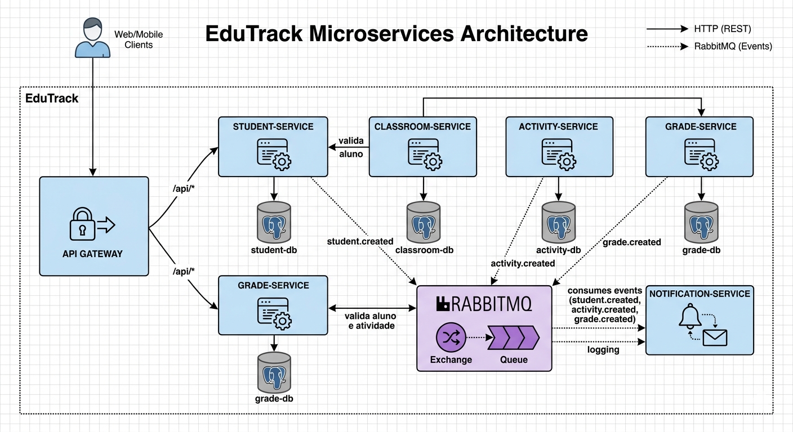

# EduTrack Microservices

Educational system built with a microservices architecture using Java, Spring Boot, and React.

---

# Architecture



Current target architecture for the EduTrack ecosystem.

# Application Preview

<p align="center">
  
</p>

---

# Purpose

This portfolio project was created to consolidate knowledge of modern backend development, microservices, and frontend integration.

The main goal is to build an incremental application that can be clearly explained in technical interviews, demonstrating:

- REST APIs
- Microservices
- Layered architecture
- Frontend and backend integration
- Docker
- PostgreSQL
- Messaging
- Automated tests
- Software engineering best practices

---

# Technology Stack

## Currently Used

### Backend

- Java 21
- Spring Boot
- Spring Web
- Spring Data JPA
- Hibernate
- OpenAPI
- Swagger UI

### Frontend

- React
- Vite
- JavaScript
- Fetch API
- React Router

### Database

- PostgreSQL

### Infrastructure in Use

- Docker
- Docker Compose

### Infrastructure Available for Future Integration

- RabbitMQ

### Testing

- JUnit
- Mockito

## Planned

- RabbitMQ messaging integration
- Spring Cloud Gateway
- GitHub Actions

---

# Project Architecture

The system is being developed with a microservices architecture in which each domain has its own responsibility and structural independence.

## Planned Microservices

The planned service boundaries are shown below:

| Service | Responsibility |
| --- | --- |
| `student-service` | Student management |
| `classroom-service` | Classroom and enrollment management |
| `activity-service` | Activity management |
| `grade-service` | Grade and average management |
| `notification-service` | Event consumption and notifications |
| `api-gateway` | Centralized application gateway |

---

# Current Project Structure

```text
edutrack-microservices/
|-- frontend/
|-- student-service/
|-- classroom-service/
|-- activity-service/
|-- grade-service/
|-- notification-service/
|-- api-gateway/
|-- screenshot/
|-- docs/
|-- docker-compose.yml
`-- README.md
```

At this stage, `student-service` and the frontend contain application code. The other service directories are placeholders for future sprints.

---

# Current Development Status

The project currently includes:

- A functional `student-service`
- A functional `classroom-service` with basic CRUD
- A routed frontend integrated with `student-service`
- Student CRUD endpoints
- Classroom CRUD endpoints
- Input validation
- Global validation error handling
- Basic unit tests
- Frontend and backend integration
- PostgreSQL persistence

---

# Implemented Features

## Backend

- Spring Boot structure
- Controller layer
- Service layer
- DTO layer
- Dependency injection
- Bean Validation
- Global validation exception handling
- Custom exception handling for student not found cases
- Missing students requested through GET, PUT or DELETE operations return an HTTP 404 Not Found response.
- JSON serialization
- Service layer unit tests
- PostgreSQL persistence
- Repository layer with Spring Data JPA
- Queries with Spring Data query methods
- Extended student profile with registration, academic, and guardian data
- Full student data mapping for create and update requests
- Student deletion endpoint
- OpenAPI documentation
- Interactive Swagger UI

### Classroom Service

- Full classroom CRUD
- PostgreSQL persistence
- JPA entity mapping
- Repository, service and controller layers
- 404 handling for missing classrooms
- Unit tests
- OpenAPI / Swagger documentation

## Frontend

- Dashboard with total student count and API availability status
- Navigation with React Router
- Student listing in a table
- Student details page
- Dedicated search-by-name page
- Spring Boot API integration
- Basic API error handling
- Scaffold pages for student creation and API status

---

# Implemented Endpoints

## List Students

```http
GET /students
```

### Example Response

```json
[
  {
    "id": 1,
    "name": "Joao"
  },
  {
    "id": 2,
    "name": "Maria"
  }
]
```

## Get Student by ID

```http
GET /students/{id}
```

### Example Request

```http
GET /students/1
```

### Example Response

```json
{
  "id": 1,
  "name": "Joao"
}
```

### Not Found Response

```http
GET /students/999
{
  "error": "Student not found",
  "message": "Student not found with id: 999",
  "status": 404
}
```

## Search Students by Name

```http
GET /students/search?name=Ana
```

### Example Response

```json
[
  {
    "id": 1,
    "name": "Ana"
  }
]
```

## Create Student

```http
POST /students
```

### Request Body

```json
{
  "name": "Carlos",
  "cpf": "12345678900",
  "registration": "2026-001",
  "grade": "8th Grade",
  "classGroup": "A",
  "shift": "Morning",
  "status": "Active",
  "guardianName": "Maria Silva",
  "averageScore": 8.7,
  "attendanceRate": 96.5
}
```

### Example Response

```json
{
  "id": 3,
  "name": "Carlos",
  "cpf": "12345678900",
  "registration": "2026-001",
  "grade": "8th Grade",
  "classGroup": "A",
  "shift": "Morning",
  "status": "Active",
  "guardianName": "Maria Silva",
  "averageScore": 8.7,
  "attendanceRate": 96.5
}
```

## Update Student

```http
PUT /students/{id}
```

### Request Body

```json
{
  "name": "Carla",
  "cpf": "12345678900",
  "registration": "2026-001",
  "grade": "8th Grade",
  "classGroup": "A",
  "shift": "Morning",
  "status": "Active",
  "guardianName": "Maria Silva",
  "averageScore": 9.1,
  "attendanceRate": 97.0
}
```

### Example Response

```json
{
  "id": 3,
  "name": "Carla",
  "cpf": "12345678900",
  "registration": "2026-001",
  "grade": "8th Grade",
  "classGroup": "A",
  "shift": "Morning",
  "status": "Active",
  "guardianName": "Maria Silva",
  "averageScore": 9.1,
  "attendanceRate": 97.0
}
```

## Delete Student

```http
DELETE /students/{id}
```

## List Classrooms

```http
GET /classrooms
```

### Example Response

```json
[
  {
    "id": 1,
    "name": "A",
    "grade": "8th Grade",
    "schoolYear": 2026,
    "shift": "Morning",
    "capacity": 30
  }
]
```

## Get Classroom by ID

```http
GET /classrooms/{id}
```

### Example Request

```http
GET /classrooms/1
```

### Example Response

```json
{
  "id": 1,
  "name": "A",
  "grade": "8th Grade",
  "schoolYear": 2026,
  "shift": "Morning",
  "capacity": 30
}
```

## Create Classroom

```http
POST /classrooms
```

### Request Body

```json
{
  "name": "A",
  "grade": "8th Grade",
  "schoolYear": 2026,
  "shift": "Morning",
  "capacity": 30
}
```

### Example Response

```json
{
  "id": 1,
  "name": "A",
  "grade": "8th Grade",
  "schoolYear": 2026,
  "shift": "Morning",
  "capacity": 30
}
```

## Update Classroom

```http
PUT /classrooms/{id}
```

### Request Body

```json
{
  "name": "B",
  "grade": "8th Grade",
  "schoolYear": 2026,
  "shift": "Afternoon",
  "capacity": 28
}
```

### Example Response

```json
{
  "id": 1,
  "name": "B",
  "grade": "8th Grade",
  "schoolYear": 2026,
  "shift": "Afternoon",
  "capacity": 28
}
```

## Delete Classroom

```http
DELETE /classrooms/{id}
```

---

# Validation and Error Handling

The project includes basic input validation with Bean Validation.

## Invalid Request Example

```http
POST /students
```

### Invalid Request Body

```json
{
  "name": ""
}
```

### Example Response

```json
{
  "error": "Validation failed",
  "fields": {
    "name": "must not be blank"
  },
  "status": 400
}
```

Global validation error handling is implemented with:

- `@RestControllerAdvice`
- `@ExceptionHandler`
- `MethodArgumentNotValidException`

Missing students requested through `GET /students/{id}` or `PUT /students/{id}` return an HTTP `404 Not Found` response.

---

# Frontend

The project includes an initial React + Vite frontend that visually demonstrates consumption of the `student-service` API.

## Frontend Features

- Dashboard with student count and API availability status
- Navigation with React Router
- Student listing in a table
- Student details page
- Dedicated search-by-name page
- Spring Boot API integration
- Basic API error handling
- Scaffold pages for student creation and API status

---

# Implemented Concepts

The project already demonstrates:

- REST APIs
- Spring controllers
- Service layer
- DTO pattern
- Dependency injection
- Inversion of control
- JSON serialization
- Bean Validation
- Global validation exception handling
- Custom exceptions
- HTTP status handling
- Centralized error handling with `@RestControllerAdvice`
- Path variables
- Query parameters
- Request bodies
- Layered architecture
- Object-oriented programming
- Initial Docker Compose setup
- Unit testing with JUnit and Mockito
- Frontend and backend integration
- React consuming a Java API
- Client-side routing with React Router
- JPA entity mapping
- Repository pattern
- Spring Data JPA query methods
- PostgreSQL persistence
- API documentation
- OpenAPI specification
- Swagger UI

---

# Implemented Tests

The project currently includes basic unit tests for `StudentService`.

## Existing Tests

- `shouldReturnAllStudents`
- `shouldReturnStudentById`
- `shouldSearchStudentByName`
- `shouldCreateStudent`
- `shouldUpdateStudent`
- `shouldDeleteStudent`
- `shouldThrowStudentNotFoundExceptionWhenDeletingMissingStudent`

## Run Tests

```bash
cd student-service
./mvnw test
```

---

# Technical Roadmap

## Sprint 1 - `student-service`

- [x] Spring Boot structure
- [x] REST endpoints
- [x] `Student` model
- [x] Service layer
- [x] DTOs
- [x] Validation
- [x] Global validation exception handling
- [x] Basic unit tests
- [x] Initial React frontend
- [x] PostgreSQL integration

## Sprint 2 - PostgreSQL Persistence

- [x] PostgreSQL configuration
- [x] Spring Data JPA
- [x] Hibernate
- [x] `Student` entity
- [x] Repository layer
- [x] Search by name with a query method
- [x] Database persistence

## Sprint 3 - Complete Student Service CRUD

- [x] `GET /students`
- [x] `GET /students/{id}`
- [x] `GET /students/search?name={name}`
- [x] `POST /students`
- [x] `PUT /students/{id}`
- [x] `DELETE /students/{id}`
- [x] 404 Not Found handling
- [x] Update tests
- [x] Delete tests
- [x] OpenAPI / Swagger

## Sprint 4 - `classroom-service`

- [x] Classroom CRUD
- [x] `GET /classrooms`
- [x] `GET /classrooms/{id}`
- [x] `POST /classrooms`
- [x] `PUT /classrooms/{id}`
- [x] `DELETE /classrooms/{id}`
- [x] Classroom 404 handling
- [x] Classroom unit tests
- [x] OpenAPI / Swagger

## Sprint 5 - `activity-service`

- [ ] Activity registration
- [ ] Activity types
- [ ] Classroom integration

## Sprint 6 - `grade-service`

- [ ] Grade registration
- [ ] Average calculation
- [ ] Academic history

## Sprint 7 - RabbitMQ

- [ ] Events between services
- [ ] Message publishing and consumption

## Sprint 8 - `notification-service`

- [ ] Event consumption
- [ ] Notification simulation

## Sprint 9 - API Gateway

- [ ] Centralized gateway
- [ ] Service routing

## Sprint 10 - Quality and DevOps

- [ ] GitHub Actions
- [ ] Complete Dockerization
- [ ] Integration tests
- [ ] Final README

---

# Running the Project

## Configure Local Environment

Copy the example environment file before starting Docker Compose:

```bash
cp .env.example .env
```

Update `.env` with your local credentials as needed. Real credentials should never be committed to the repository.

## Start the Local Infrastructure

```bash
docker compose up -d
```

## Run the Student Service

```bash
cd student-service
./mvnw spring-boot:run
```

The backend is available at:

```text
http://localhost:8081
```

## Run the Classroom Service

```bash
cd classroom-service
./mvnw spring-boot:run
```

The classroom service is available at:

```text
http://localhost:8082
```

Classroom service Swagger UI:

```text
http://localhost:8082/swagger-ui/index.html
```

## Run the Frontend

```bash
cd frontend
npm install
npm run dev
```

The frontend is available at:

```text
http://localhost:5173
```

---

# Available Local Services

## RabbitMQ

Management interface:

```text
http://localhost:15672
```

Username:

```text
Configured by `RABBITMQ_USER` in `.env`
```

Password:

```text
Configured by `RABBITMQ_PASSWORD` in `.env`
```

## PostgreSQL

The local PostgreSQL service ports are listed below:

| Service | Port |
| --- | --- |
| `student-db` | `5433` |
| `classroom-db` | `5434` |
| `activity-db` | `5435` |
| `grade-db` | `5436` |

---

# Learning Goals

This project is being used to consolidate knowledge of:

- Modern Java
- Spring Boot
- Microservices
- REST APIs
- React
- Frontend and backend integration
- DTO pattern
- Bean Validation
- Automated tests
- Global exception handling
- Docker
- PostgreSQL
- RabbitMQ
- Backend architecture
- Software engineering best practices
- Basic DevOps

---

# Notes

The `student-service` currently uses PostgreSQL persistence. The other microservices will be implemented in future sprints.

## Data Persistence

The project uses PostgreSQL with Spring Data JPA and Hibernate for data persistence.

For more details, see [`docs/persistence.md`](docs/persistence.md).
